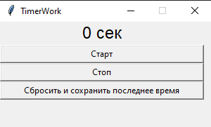
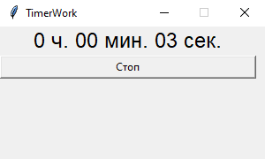
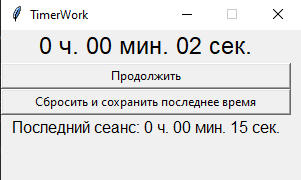
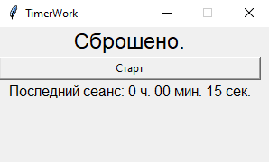

# TimerWork.

Маленькая утилитка таймер, для отслеживания рабочего/учебного времени.
Отсчитывает с момента запуска время. Поддерживает остановку и продолжение отсчета.
Поддерживает сохранение последнего сеанса запуска таймера.
> После закрытия программы все данные теряются.
<br>

Можно было бы использовать телефон, но хотелось на пк и без риска получить
вредоносное ПО, плюс немного новых знаний.

#### Стартовое состояние.


#### В процессе отсчета.


#### На паузе.


#### Сброшен основной таймер и сохранено его время.


## Запуск

Клонировать репозиторий:

```
git clone https://github.com/YuraEtalking/TimerWork.git
```

Cоздать и активировать виртуальное окружение:

```
python -m venv venv
```

* Если у вас Linux/macOS

    ```
    source venv/bin/activate
    ```

* Если у вас windows

    ```
    .\venv\Scripts\Activate.ps1
    ```


<br>

## Стек технологий
Python 3.10

<br>

#### Автор [Юрий Рыжков](https://github.com/YuraEtalking)
